<div align="center">



<br>

# Building practical AI tools for public-sector work

### Public HR × AI Transformation × Local-first Software

반복되는 행정과 HR 업무를 더 단순하고 신뢰할 수 있는 도구로 바꿉니다.

[](mailto:kyci@naver.com)
[](https://github.com/koul777)

</div>

---

## What I Do

공공기관 HR 현장에서 발견한 문제를 **AI, 데이터 분석, 자동화**로 해결합니다.
새로운 기술을 도입하는 데서 멈추지 않고, 실제 일하는 방식의 변화로 이어지는 제품을 만들고 있습니다.

```text
Public HR       채용 · 인사 · 성과 · 보수 · 복무 업무 혁신
AI Transformation  사람과 조직 중심의 지속 가능한 변화관리
HR Analytics    업무 데이터를 활용한 검증 · 분석 · 의사결정 지원
Local-first AI  민감한 데이터를 위한 로컬 자동화 · RAG · MCP
```

## Featured Projects

| Project | What it solves |
|---|---|
| [Public-Regulation-MCP-Builder](https://github.com/koul777/Public-Regulation-MCP-Builder) | 공공기관 내부 규정을 전처리하고 승인된 데이터만 로컬 RAG·MCP로 연결합니다. |
| [VHLookup](https://github.com/koul777/VHLookup) | 반복되는 공공행정 엑셀 업무를 로컬에서 자동화합니다. |
| [NCS_Interview](https://github.com/koul777/NCS_Interview) | AI와 NCS를 활용해 구조화면접 질문을 추천합니다. |
| [attendance-checker](https://github.com/koul777/attendance-checker) | 엑셀 기반 근태 데이터의 이상 징후를 빠르게 점검합니다. |
| [clickguide-local-private](https://github.com/koul777/clickguide-local-private) | 복잡한 업무 절차를 로컬 단계별 가이드로 전환합니다. |

## Currently Exploring

- 승인 이력과 출처가 명확한 공공기관 규정 RAG·MCP
- NCS 기반 구조화면접 질문 생성
- 공공기관 총인건비 인상률 시뮬레이션
- 생성형 AI를 활용한 HR 업무와 조직 변화

## Stack


## Beyond Code

- 공공기관 HR 실무와 AI Transformation을 연구하고 이야기합니다.
- 생성형 AI·HR Analytics 스터디 **Smart HR Lab**을 이끌고 있습니다.
- 생성형 AI, HR, 일자리의 변화를 주제로 책을 쓰고 강연합니다.

## GitHub Activity

<div align="center">


</div>

---

<div align="center">

**현장의 문제를 연구로 구조화하고, 다시 작동하는 도구로 구현합니다.**

기고 및 강연 문의 · [kyci@naver.com](mailto:kyci@naver.com)

</div>
