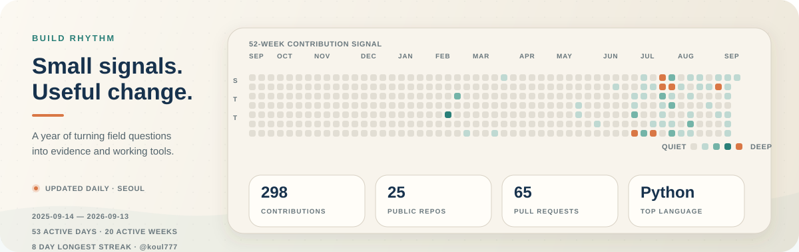
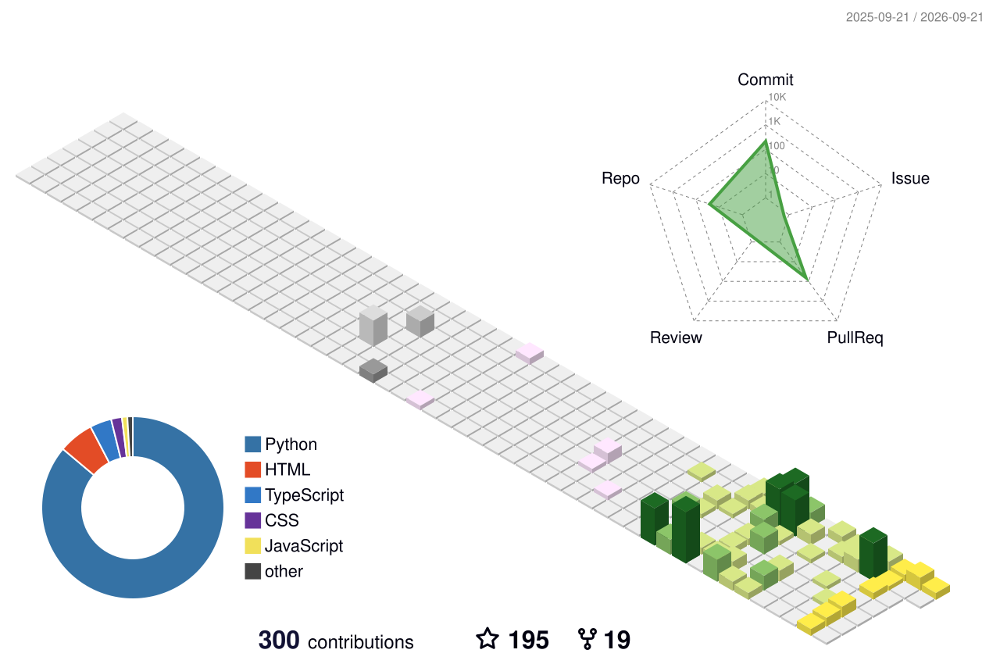

<div align="center">



<br>

# 일하는 방식의 혁신을 추구합니다

### People Analytics × Change Management × Public Administration

People Analytics와 AI로 문제를 발견하고, Change Management를 통해 실제 변화로 연결합니다.

[](https://github.com/koul777)
[](https://brunch.co.kr/@publichr)

</div>

---

## What I Do

공공기관 인사조직 현장의 문제를 **AI, 데이터 분석, 자동화**로 해결합니다.
기술 도입을 넘어, 실제 일하는 방식의 혁신과 지속 가능한 조직 변화를 추구합니다.

```text
Public HR       채용 · 인사 · 성과 · 보수 · 복무 업무 혁신
AI Transformation  사람과 조직 중심의 지속 가능한 변화관리
HR Analytics    업무 데이터를 활용한 검증 · 분석 · 의사결정 지원
Local-first AI  민감한 데이터를 위한 로컬 자동화 · RAG · MCP
```

## Selected Work

<table>
  <tr>
    <td width="50%" valign="top">
      <sub>FAIR HIRING · MCP · LOCAL-FIRST</sub><br><br>
      <a href="https://github.com/koul777/fairpost-mcp"><strong>FairPost MCP</strong></a>
      <p>채용공고의 표현, 빠진 정보, 후속 검토 질문을 법령 근거와 함께 정리합니다. 판정 대신 사람이 확인하고 고칠 수 있는 단서를 제공합니다.</p>
    </td>
    <td width="50%" valign="top">
      <sub>PEOPLE ANALYTICS · OPENDART · AI BRIEFING</sub><br><br>
      <a href="https://github.com/koul777/dart-hr-briefing"><strong>DART HR Briefing</strong></a>
      <p>기업의 재무·인력·보상·임원 공시를 같은 기준으로 비교하고, 출처를 추적할 수 있는 대화형 HR 브리핑으로 연결합니다.</p>
    </td>
  </tr>
  <tr>
    <td width="50%" valign="top">
      <sub>NCS KNOWLEDGE GRAPH · MCP · VERCEL</sub><br><br>
      <a href="https://github.com/koul777/HRMCP"><strong>HRMCP</strong></a>
      <p>NCS 지식그래프를 MCP로 제공해 ChatGPT·Claude에서 직무기술서 작성, NCS 구조 검색, 교육훈련 추천을 근거와 함께 연결합니다.</p>
    </td>
    <td width="50%" valign="top">
      <sub>NCS · HWPX · AGENT WORKFLOW</sub><br><br>
      <a href="https://github.com/koul777/NCS_JD"><strong>NCS JD</strong></a>
      <p>채용공고에서 NCS 능력단위와 KSA 근거를 찾아, 사람이 검토할 수 있는 직무기술서 HWPX 초안을 로컬에서 생성합니다.</p>
    </td>
  </tr>
  <tr>
    <td width="50%" valign="top">
      <sub>PUBLIC HR · NCS · STRUCTURED INTERVIEW</sub><br><br>
      <a href="https://github.com/koul777/NCScope"><strong>NCScope</strong></a>
      <p>공고문과 직무기술서에서 NCS 세분류와 공식 KSA를 찾고, 근거가 남는 구조화 면접 질문까지 한 흐름으로 만듭니다.</p>
    </td>
    <td width="50%" valign="top">
      <sub>POLICY · RAG · APPROVAL WORKFLOW</sub><br><br>
      <a href="https://github.com/koul777/Public-Regulation-MCP-Builder"><strong>Public Regulation MCP Builder</strong></a>
      <p>공공기관 내부 규정을 구조화하고, 검토·승인된 데이터만 로컬 RAG와 MCP에 연결해 답변의 근거를 통제합니다.</p>
    </td>
  </tr>
  <tr>
    <td width="50%" valign="top">
      <sub>GENERATIVE AI · PRESENTATION · LOCAL APP</sub><br><br>
      <a href="https://github.com/koul777/slideforge"><strong>SlideForge</strong></a>
      <p>주제나 원문에서 슬라이드 초안을 만들고, 브라우저 편집을 거쳐 PPTX 또는 PDF로 내보내는 로컬 AI 제작 도구입니다.</p>
    </td>
    <td width="50%" valign="top">
      <sub>NLP · SURVEY · DECISION SUPPORT</sub><br><br>
      <a href="https://github.com/koul777/AI-Survey-Insight"><strong>AI Survey Insight</strong></a>
      <p>한국어 설문 자유응답을 토픽·감정·핵심 문장으로 분석하고, 대시보드와 보고서까지 빠르게 생성합니다.</p>
    </td>
  </tr>
  <tr>
    <td width="50%" valign="top">
      <sub>EXCEL · PUBLIC ADMINISTRATION · AUTOMATION</sub><br><br>
      <a href="https://github.com/koul777/VHLookup"><strong>VHLookup</strong></a>
      <p>공공행정 실무에서 반복되는 엑셀 조회·대조 작업을 로컬 환경에서 빠르고 재현 가능하게 자동화합니다.</p>
    </td>
    <td width="50%" valign="top">
      <sub>ATTENDANCE · ANOMALY SIGNAL · LOCAL DATA</sub><br><br>
      <a href="https://github.com/koul777/attendance-checker"><strong>Attendance Checker</strong></a>
      <p>엑셀 근태 데이터를 외부로 보내지 않고 분석해, 담당자가 먼저 살펴볼 이상 징후를 빠르게 식별합니다.</p>
    </td>
  </tr>
</table>

<p align="center">
  <sub>ANOTHER WORKING TOOL</sub><br>
  <a href="https://github.com/koul777/clickguide-local-private"><strong>ClickGuide Local</strong></a> — 복잡한 업무 절차를 로컬 단계별 가이드로 전환합니다.
</p>

## Now / Next

| 01 · Trusted knowledge | 02 · Better selection |
|---|---|
| 승인된 규정과 근거 출처로만 동작하는 공공기관 RAG·MCP | NCS 기반 구조화 면접과 검증 가능한 질문 설계 |
| **03 · Workforce simulation** | **04 · Change that lasts** |
| 공공기관 총인건비 인상률과 인력 시나리오 시뮬레이션 | 생성형 AI 도입 이후의 HR 업무·역할·조직 변화 |

## Toolkit

<div align="center">

**ANALYZE**<br>


**BUILD**<br>


**CONNECT**<br>


</div>

## Beyond the Repository

| Research & Practice | Community | Writing & Speaking |
|:---:|:---:|:---:|
| 공공기관 HR 실무와 AI Transformation을 연구합니다. | 생성형 AI·HR Analytics 스터디 **Smart HR Lab**을 이끌고 있습니다. | 생성형 AI, HR, 일자리의 변화를 주제로 책을 쓰고 강연합니다. |

## Build Rhythm

<div align="center">



</div>

<details>
<summary><strong>3D contribution landscape 보기</strong></summary>
<br>

<div align="center">



</div>
</details>

<details>
<summary><strong>Open-source acknowledgements</strong></summary>
<br>

- [NCScope](https://github.com/koul777/NCScope)는 직무기술서·공고문 파싱에 [Kordoc](https://github.com/chrisryugj/kordoc)을 사용합니다.
- [Public-Regulation-MCP-Builder](https://github.com/koul777/Public-Regulation-MCP-Builder)는 HWP 표 구조 보강과 전처리 검증에 Kordoc을 선택적으로 활용합니다.
- Kordoc은 별도 MIT 라이선스 오픈소스 프로젝트이며, 각 프로젝트의 제3자 고지와 라이선스 안내를 함께 확인해야 합니다.

</details>

---

<div align="center">

### Field question → Evidence → Working tool → Better work

**현장의 문제를 연구로 구조화하고, 다시 작동하는 도구로 구현합니다.**

</div>
